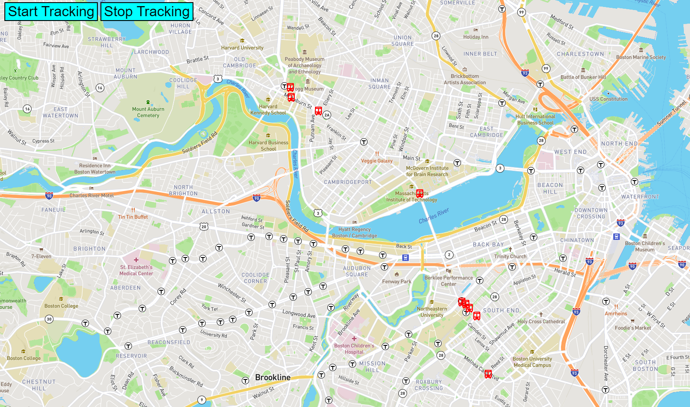

# Bus Tracker

## Project Overview

Bus Tracker is a webpage that tracks and shows the bus locations in Boston/Cambridge area. Buses are displayed with a bus icon on a map.

## How to Run

1. Replace YOUR-API-KEY in bus_tracker.js file with a valid mapbox gl access key
2. Open up bus_tracker.html

## Scope of Funtionality & Improvements Roadmap

The application supports:

- User can start and stop tracking
- Real time bus location tracking

Improvements Roadmap:

- Specifying the direction of the bus can improve user experience.

## Technologies Used

- Javascript: For providing animation and interactive functionalities
- HTML: For providing the page
- CSS: For providing style of the page
- Mapbox GL JS library: For providing the map on the screen

## License
[MIT LICENSE](LICENSE)
